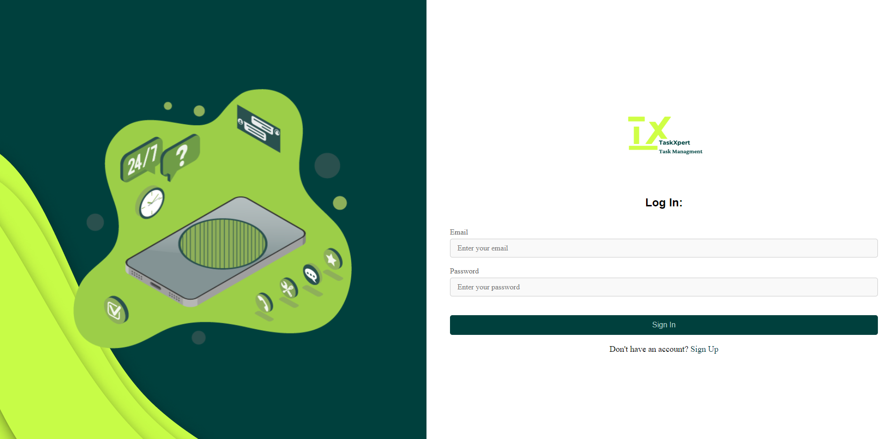
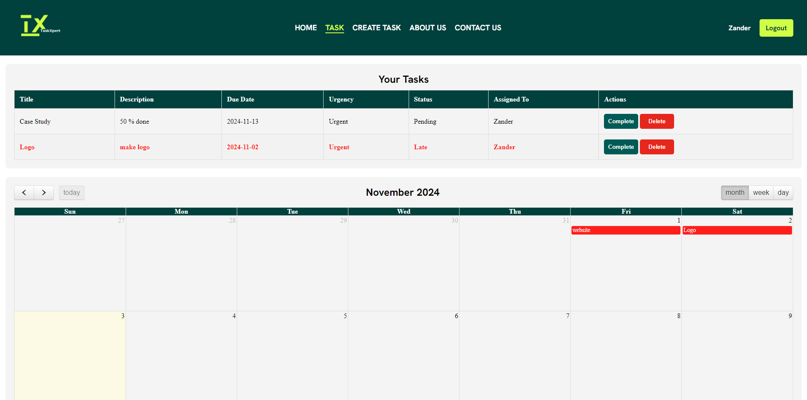
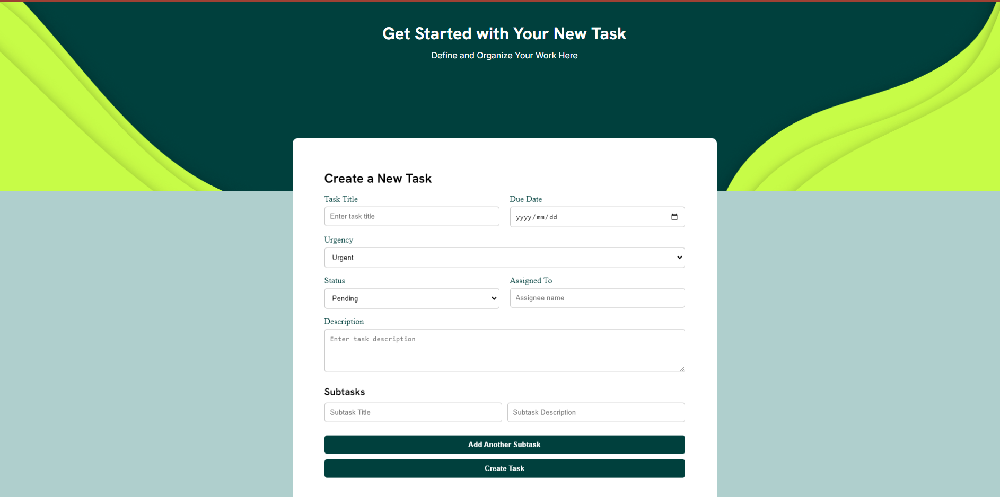
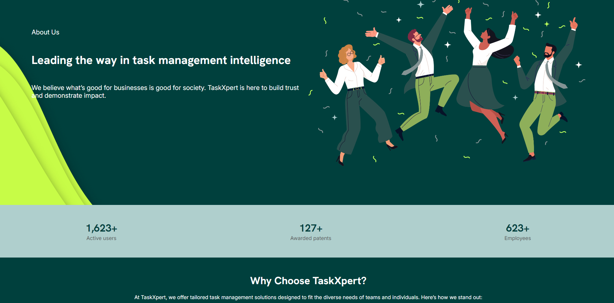
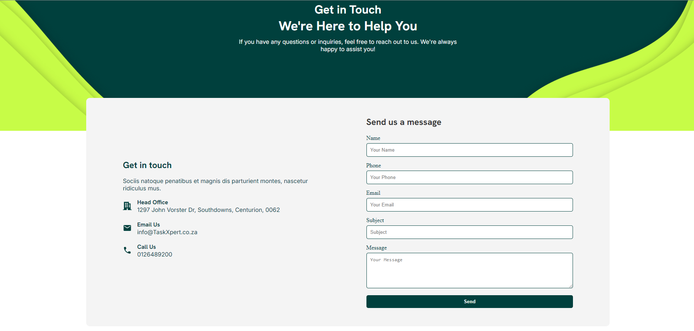
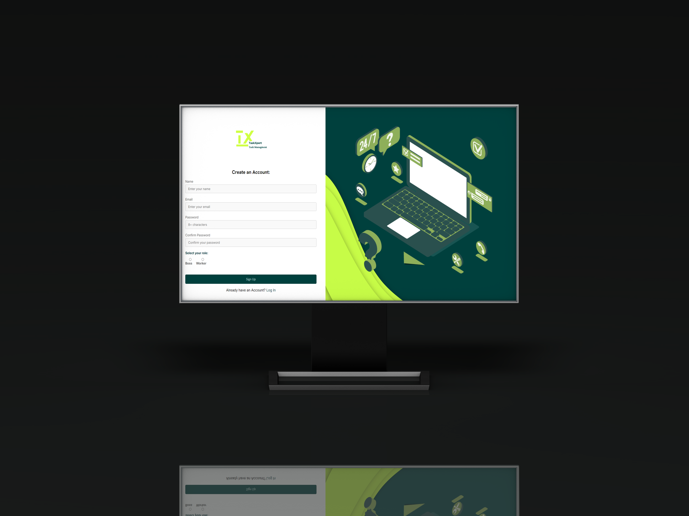
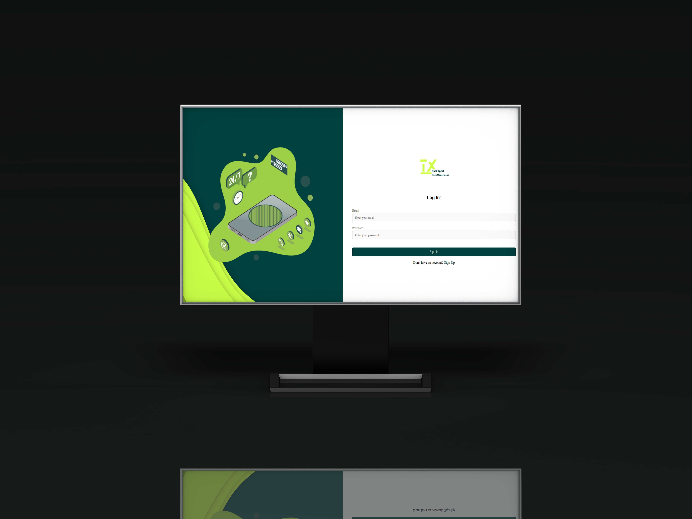
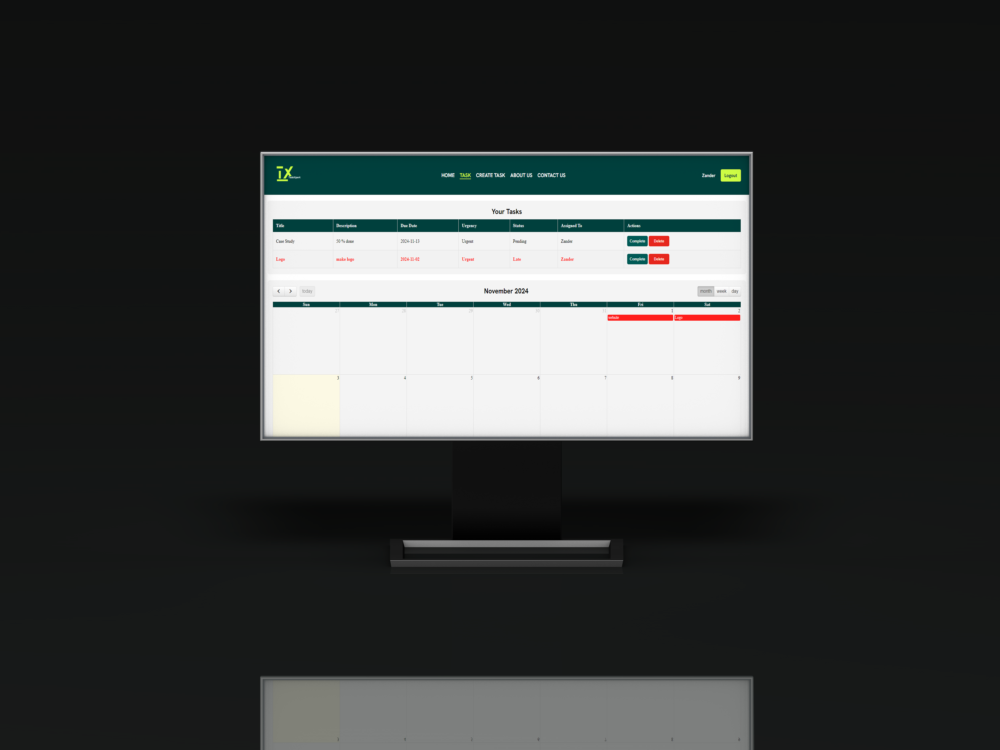
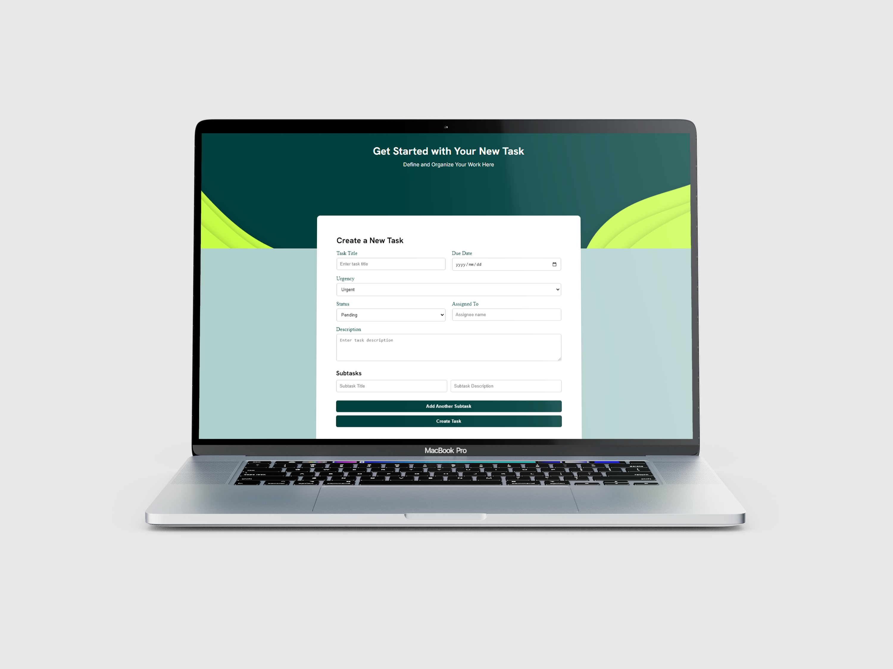

<!-- Repository Information & Links-->
<br />

<p align="center">
  
  
  
  
</p>

<!-- HEADER SECTION -->
<h5 align="center" style="padding:0;margin:0;">Zander Bezuidenhout</h5>
<h5 align="center" style="padding:0;margin:0;">Student Number: [Your Student Number]</h5>
<h6 align="center">[Course Name & Year]</h6>
</br>
<p align="center">
  <a href="https://github.com/ZanderBez/Management">
    
  </a >
</p>
  
<h3 align="center">TaskXpert</h3>
<h4 align="center">Web Application</h4>

<p align="center">
  An efficient task management web application for collaborative task tracking and management.<br>
  <a href="https://github.com/ZanderBez/Management"><strong>Explore the docs »</strong></a>
  <br />
  <br />
  <a href="https://drive.google.com/file/d/1-Jl8o1mKKxr5218T8819GHztr8hm_4hb/view?usp=sharing">View Demo</a>
  ·
  <a href="https://github.com/ZanderBez/Management/issues">Report Bug</a>
  ·
  <a href="https://github.com/ZanderBez/Management/issues">Request Feature</a>
</p>

<!-- TABLE OF CONTENTS -->
## Table of Contents

* [About the Project](#about-the-project)
  * [Project Description](#project-description)
  * [Built With](#built-with)
* [Getting Started](#getting-started)
  * [Prerequisites](#prerequisites)
  * [How to install](#how-to-install)
* [Features and Functionality](#features-and-functionality)
* [Concept Process](#concept-process)
   * [Ideation](#ideation)
   * [Wireframes](#wireframes)
   * [User-flow](#user-flow)
* [Development Process](#development-process)
   * [Implementation Process](#implementation-process)
        * [Highlights](#highlights)
        * [Challenges](#challenges)
   * [Reviews and Testing](#peer-reviews)
        * [Feedback from Reviews](#feedback-from-reviews)
        * [Unit Tests](#unit-tests)
   * [Future Implementation](#future-implementation)
* [Final Outcome](#final-outcome)
    * [Mockups](#mockups)
    * [ER Diagram](#er-diagram)
    * [Video Demonstration](#video-demonstration)
* [Conclusion](#conclusion)
* [Roadmap](#roadmap)
* [Contributing](#contributing)
* [License](#license)
* [Contact](#contact)
* [Acknowledgements](#acknowledgements)

<!--PROJECT DESCRIPTION-->
## About the Project
<!-- header image of project -->


### Project Description

TaskXpert is a task management web application that allows users to create, view, and manage tasks efficiently. Designed to support role-based access, TaskXpert tailors its features for both workers and bosses, enabling seamless task collaboration and management.

### Built With

[](https://www.php.net/docs.php)
[](https://www.mysql.com/)
[](https://html.spec.whatwg.org/multipage/)
[](https://developer.mozilla.org/en-US/docs/Web/CSS)
[](https://www.javascript.com/)
[](https://www.apachefriends.org/index.html)

<!-- GETTING STARTED -->
## Getting Started

The following instructions will help you set up your copy of the project for development and testing purposes.

### Prerequisites

- [XAMPP](https://www.apachefriends.org/index.html) or similar local server environment.
- PHP 7.x or later.
- MySQL or MariaDB database.

### How to install

1. **Clone the repository**:
    ```bash
    git clone https://github.com/ZanderBez/Management.git
    ```
2. **Move the project to your XAMPP `htdocs` directory**:
    ```bash
    mv Management /path/to/xampp/htdocs/
    ```
3. **Set up the database**:
    - Import the database structure from `management.sql` using phpMyAdmin or MySQL:
      ```bash
      mysql -u root -p management < /path/to/management.sql
      ```
4. **Update Database Configuration**:
    - Modify the `db_connect.php` file with your database credentials:
    ```php
    $servername = "localhost";
    $username = "root";
    $password = "";
    $dbname = "management";
    ```
5. **Start the server**:
    - Open XAMPP and start Apache and MySQL services.
6. **Access the Application**:
    - Navigate to `http://localhost/Management/Pages/signIn.php` in your browser.

<!-- FEATURES AND FUNCTIONALITY -->
## Features and Functionality

### Core Features
- **User Authentication**: Sign up, log in, and manage accounts.
- **Task Management**: Create, view, and manage tasks.
- **Role-Based Access**: Separate views for bosses and workers.
- **Overdue Task Alerts**: Visual indicators for overdue tasks.
- **Responsive Design**: Optimized for mobile and desktop.
- **Real-Time Collaboration**: Real-time task updates.

<!-- CONCEPT PROCESS -->
## Concept Process

The project was conceptualized to provide a clear and organized way to manage tasks, especially for environments where roles and permissions are key.

### Ideation

Initial brainstorming focused on making task management simple and efficient for various user roles.

### Wireframes









### User-flow

Outlined user flows for both bosses and workers to ensure seamless task creation and management.

<!-- DEVELOPMENT PROCESS -->
## Development Process

### Implementation Process

* Built using PHP and MySQL for backend logic.
* Created dynamic and responsive user interfaces with HTML, CSS, and JavaScript.
* Structured a clear role-based access system for bosses and workers.

#### Highlights
* Effective role-based task management.
* Integration of real-time task updates.

#### Challenges
* Managing complex role-based data.
* Optimizing UI for responsive behavior.

### Reviews & Testing

#### Feedback from Reviews

Feedback highlighted the clear role division and user-friendly UI. Suggested adding additional task filtering options.

#### Unit Tests

Basic testing was done to ensure smooth authentication and task creation. Future improvements include more comprehensive database interaction tests.

<!-- FUTURE IMPLEMENTATION -->
### Future Implementation

* Add a notification system for task deadlines.
* Implement more advanced task filtering and sorting options.
* Introduce user profiles with customizable preferences.
* Enhance security with two-factor authentication.
* Integrate a chat feature for better team communication.

<!-- FINAL OUTCOME -->
## Final Outcome

### Mockups








### ER Diagram


### Video Demonstration

[View Demonstration](https://drive.google.com/file/d/1-Jl8o1mKKxr5218T8819GHztr8hm_4hb/view?usp=sharing)

<!-- ROADMAP -->
## Roadmap

See the [open issues](https://github.com/ZanderBez/Management/issues) for a list of proposed features and known issues.

<!-- CONTRIBUTING -->
## Contributing

Contributions make the open-source community such a fantastic place to learn, inspire, and create. Any contributions you make are **greatly appreciated**.

1. Fork the Project
2. Create your Feature Branch (`git checkout -b feature/AmazingFeature`)
3. Commit your Changes (`git commit -m 'Add some AmazingFeature'`)
4. Push to the Branch (`git push origin feature/AmazingFeature`)
5. Open a Pull Request

<!-- AUTHORS -->
## Authors

* **Zander Bezuidenhout** - [ZanderBez](https://github.com/ZanderBez)

<!-- LICENSE -->
## License

Distributed under the MIT License. See `LICENSE` for more information.

<!-- CONTACT -->
## Contact

* **Zander Bezuidenhout** - [bezuidenhoutzander8@gmail.com](mailto:bezuidenhoutzander8@gmail.com)
* **Project Link** - [TaskXpert](https://github.com/ZanderBez/Management)

<!-- ACKNOWLEDGEMENTS -->
## Acknowledgements

* [PHP Documentation](https://www.php.net/docs.php)
* [MySQL Documentation](https://www.mysql.com/)
* [MDN Web Docs](https://developer.mozilla.org/en-US/)
* [XAMPP](https://www.apachefriends.org/index.html)
