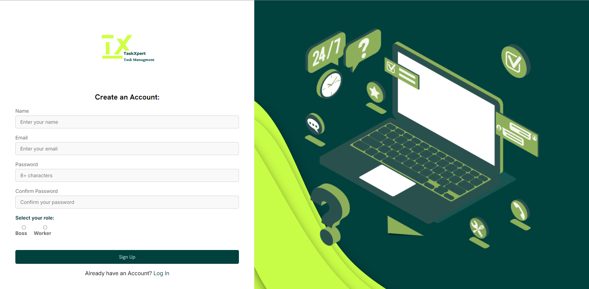

# TaskXpert Web Application

TaskXpert is a task management web application that allows users to create, view, and manage tasks in an efficient, collaborative way. The application supports both workers and bosses, providing customized features and views for each role. 

## Table of Contents

1. [Built With](#built-with)
2. [Features](#features)
3. [UI Design](#ui-design)
4. [Installation](#installation)
5. [MockUps](#mockups)
6. [Usage](#usage)
7. [Folder Structure](#folder-structure)
8. [Database Structure](#database-structure)
9. [Technologies Used](#technologies-used)
10. [Contributing](#contributing)
11. [Demo Video](#demo-video)
12. [License](#license)
13. [Contact](#contact)

## Built With 

[](https://www.php.net/docs.php)
[](https://www.php.net/docs.php)
[](https://html.spec.whatwg.org/multipage/)
[](https://developer.mozilla.org/en-US/docs/Web/CSS)
[](https://www.javascript.com/)
[](https://www.apachefriends.org/index.html)

## Features

- **User Authentication**: Allows users to sign up, log in, and manage their accounts.
- **Task Management**: Users can create tasks, set due dates, and mark them as completed.
- **Role-Based Access**: Customized views for workers and bosses, with bosses able to view all tasks on a calendar.
- **Overdue Task Alerts**: When a task passes its due date without completion, it is automatically highlighted in red to indicate it's overdue, making it easy for users to identify and prioritize late tasks.
- **Responsive Design**: Fully responsive for optimal use on mobile and desktop devices.
- **Real-Time Collaboration**: Users can see and manage tasks in real-time.

## UI Design 

### Sign Up Page


### Log In Page


### Home Page


### Task Page


### Create Task Page


### About Us Page


### Contact Us Page


## Installation

### Prerequisites

- [XAMPP](https://www.apachefriends.org/index.html) or similar local server environment.
- PHP 7.x or later
- MySQL or MariaDB database

### Steps

1. **Clone the repository**:
    ```bash
    git clone https://github.com/ZanderBez/Management.git
    ```
2. **Move the project to your XAMPP `htdocs` directory**:
    ```bash
    mv Management /path/to/xampp/htdocs/
    ```
3. **Set up the database**:
    - Import the database structure from `management.sql` using phpMyAdmin or MySQL:
      ```bash
      mysql -u root -p task_management < /path/to/task_management.sql
      ```

4. **Update Database Configuration**:
    - Modify the `db_connect.php` file with your database credentials:
    ```php
    $servername = "localhost";
    $username = "root";
    $password = "";
    $dbname = "managment";
    ```
5. **Start the server**:
    - Open XAMPP and start Apache and MySQL services.

6. **Access the Application**:
    - Open your browser and navigate to `http://localhost/Management/Pages/signIn.php`.

## MockUps

### Sign Up Page


### Log In Page


### Home Page 


### Task Page 


### Create Task Page 


### About Us Page


### Contact Us Page


### User Roles

- **Boss**: Can view all tasks on the calendar, assign tasks, and track completion.
- **Worker**: Can create, complete, and delete their own tasks. Tasks appear in red when overdue to signify missed deadlines.

## Folder Structure

The folder structure is organized as follows:

```plaintext
Management/
├── Assets/                    # Images and other static assets
├── CSS/                       # CSS files for styling
│   ├── aboutUs&contact.css
│   ├── createTask.css
│   ├── index.css
│   ├── signIn.css
│   ├── signUp.css
│   └── task.css
├── Events/                    # Event-based PHP files for task actions
│   ├── completeTask.php
│   ├── deleteTask.php
│   └── submitTask.php
├── Pages/                     # Main application pages
│   ├── aboutUs.php
│   ├── contactUs.php
│   ├── createTask.php
│   ├── index.php
│   ├── logout.php
│   ├── signIn.php
│   ├── signUp.php
│   └── task.php
├── db_connect.php             # Database connection file
└── LICENSE                    # License file
└── README.md                 # readme file
```
## Database Structure

- **users**: Stores user information (id, name, email, role, password).
- **tasks**: Stores tasks data (task_id, user_id, title, description, due date, status).
- **subtasks**: Stores subtasks data (task_id, title, description, status).

### ER Diagram

Below is a simplified Entity-Relationship (ER) diagram illustrating the relationships between the **users**, **tasks**, and **subtasks** tables:


## Technologies Used

- **Front-end**:
  - HTML
  - CSS
  - JavaScript

- **Back-end**:
  - PHP
  - MySQL

## Contributing

I would like to express my gratitude to my lecturer, [Tsungai Katsuro](https://github.com/TsungaiKats), for his guidance and support throughout this year.

## Demo Video
[Demo Video](https://github.com/ZanderBez)

## MERN Application Development Progress
[MERN Application Development Progress Check](https://docs.google.com/document/d/1Mw2lE6nlyJdqrWx571rrWy_3HNGt5-Z85uFAPTMAX6k/edit?usp=sharing)

## Open Brief Proposal
[Open Brief Proposal](https://docs.google.com/document/d/1GBrl1ytn0SXZCa9-w9S2yb_qJW4M0cPhj6W-EmqYmvw/edit?usp=sharing)

## License


This project is licensed under the MIT License - see the LICENSE file for details.

## Contact

- **Name**: Zander Bezuidenhout
- **Email**: bezuidenhoutzander8@gmail.com
- **GitHub**: [https://github.com/ZanderBez](https://github.com/ZanderBez)

 
